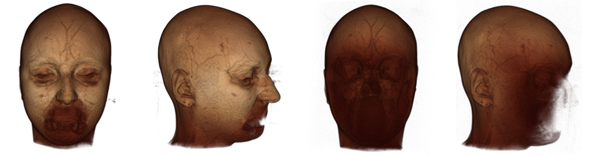
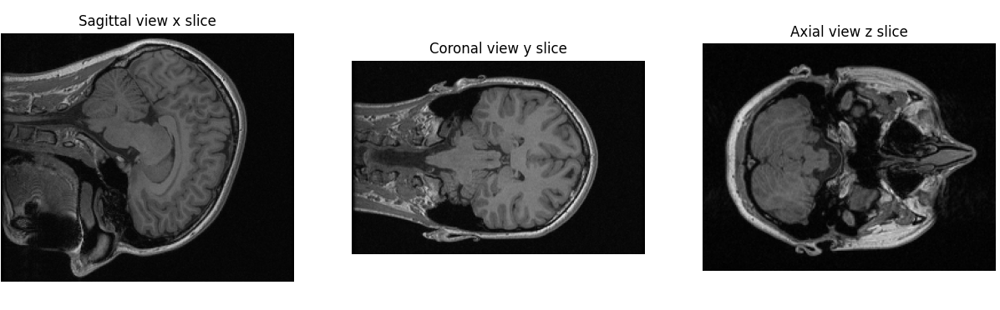
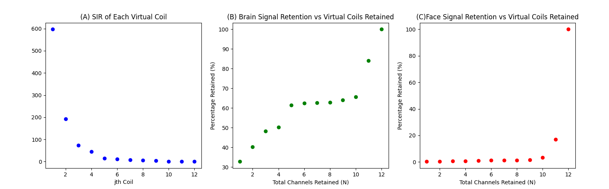

# MRI Defacer

MRI Defacer is a tool for defacing multi-channel raw 3D MRI brain data. Instead of defacing reconstructed images which permanently alters the raw k-space data, MRI Defacer defaces in k-space to preserve the raw data. This defaced data can then be used and shared for reconstruction research, where having true raw data and protecting the privacy of participants is important.

### Brief Pipeline Overview
We use the region-optmized virtual coils (ROVir) [[1]](#1-kim-d-cauley-sf-nayak-ks-leahy-rm-haldar-jp-region--optimized-virtual-rovir-coils-localization-andor-suppression-of-spatial-regions-using-sensor--domain-beamforming-magn-reson-med-202186197212-httpsdoiorg101002mrm28706) framework to locally supress facial signal in k-space. Here are the steps we take: <br/>

(1) We make an initial reconstruction to define the brain and face regions.

(2) We employ TotalSegmentator's face_mr and total_mr tasks [[2]](#2-wasserthal-j-breit-h-c-meyer-mt-pradella-m-hinck-d-sauter-aw-heye-t-boll-d-cyriac-j-yang-s-bach-m-segeroth-m-2023-totalsegmentator-robust-segmentation-of-104-anatomic-structures-in-ct-images-radiology-artificial-intelligence-httpsdoiorg101148ryai230024) to automatically generate a mask for the face and brain regions. We manipulate these masks to simplify their geometry and create space between them to optimize masking for the ROVir framework.

(3) We define a ROVir transform based on these masks. This transform mixes the original measurement coils to form virtual coils, with signal concentrated in either the brain or face regions. You can see the effect in [demo.ipynb](demo.ipynb), where the virtual coils are displayed.

(4) We retain only the top virtual coils with only high brain region signal and discard the virtual coils that have high face region signal. Combining only the top virtual coils yields defaced k-sapce data. 

The benefit of this pipeline is that we act on the coil dimension, discarding only coils with high face region signal, thus preserving raw k-space data. Currently, we have evaluated the pipeline using 14 sets of 12-channel data from Calgary Campinas [[3]](#3-r-souza-et-al-an-open-multi-vendor-multi-field-strength-brain-mr-dataset-and-analysis-of-publicly-available-skull-stripping-methods-agreement-neuroimage-vol-170-pp-482494-apr-2018-doi-httpsdoiorg101016jneuroimage201708021) and one in-house obtained 48-channel dataset. On avergae, we saw a 64.3% brain retention and 1.5% face retention in the 12-channel datasets. For the 48-channel dataset, there was a 89% brain retention and 1.8% face retention. The number of channels your data has may affect the defacing abilities. 

## Installation and Usage
Set up a Python environment for MRI Defacer

```
conda create -n MRIDEFACER python=3.13
```

Install TotalSegmentator and the following required dependencies

```
pip install kneed==0.7.0
pip install matplotlib==3.10.3
pip install nibabel==5.3.2
pip install numpy==1.26.4
pip install scipy==1.15.3
pip install scikit-image==0.25.2
pip install TotalSegmentator==2.10.0
pip install PyQt5==5.15.11
```

Alternatively, you may use the requirements.txt file to quickly install the dependencies using 
```
pip install -r requirements.txt
```

Clone and open this GitHub repository

```
git clone https://github.com/chiew-group/MRI-defacer.git
cd MRI-defacer
```

Note that our pipeline uses the face_mr task from TotalSegmentator, which requires a free non-commercial use license. You must obtain and activate the license before using this tool. You can find out how to do so from the TotalSegmentator repository [[2]](#2-wasserthal-j-breit-h-c-meyer-mt-pradella-m-hinck-d-sauter-aw-heye-t-boll-d-cyriac-j-yang-s-bach-m-segeroth-m-2023-totalsegmentator-robust-segmentation-of-104-anatomic-structures-in-ct-images-radiology-artificial-intelligence-httpsdoiorg101148ryai230024).

After cloning the repository, head to the [config.json](config.json) file to specify your inputs. A description of each field can be found in the [Expected Input](#expected-input) section. Then, run the [main.py](main.py) file. Given the expected input formats, this tool is fully automated. The output is the defaced raw k-space data.

## Expected Input

### Orientation of Data
The format of the k-space data is expected to have the shape (x, y, z, channel), where the x-axis corresponds to sagittal slices, y-axis corresponds to coronal slices, and z-axis corresponds to axial slices. In addition, the voxel spacings are expected to be positive (e.g., +1mm). Here is how the expected orientation looks displayed using Matplotlib (i.e. displaying a slice image[x_slice, :, :]):

Alternatively, you can specify in the config.json file what your current image shape and voxel spacings are, and the program will handle it. The default shape is (x, y, z, channel) and the default voxel spacings are +1mm.

### Input Parameters

| Parameter         | Expected Type | Description                               | 
| -------------     | ------------- | -------------                             | 
| data_path         | string        | path to raw 4D numpy k-space data         |
| data_id           | string        | ID for data ouput paths                   |
| x_slice           | int           | slice number for sagittal view            | 
| y_slice           | int           | slice number for coronal view             |
| z_slice           | int           | slice number for axial view               |
| threshold_method  | string        | 'SIR', 'brain_retain', 'face_retain' *    | 
| threshold         | int or null   | see explanation below *                   |
| gap               | int           | size of gap between face and brain mask * | 
| x_y_z_channel     | list          | see explanation below *                   | 
| a11               | float         | x-axis image voxel resolution (millimeters)| 
| a22               | float         | y-axis image voxel resolution (millimeters)| 
| a33               | float         | z-axis image voxel resolution (millimeters)| 


### Further Explanation of Select Input Parameters *
#### 1. threshold_method | default = 'face_retain'
This parameters specifices the quantitative metric used to select the top virtual coils to retain in the final defaced data ([see Brief Pipeline Overview step (4)](#brief-pipeline-overview)). We suggest using the default method we tested using our data, but leave options for exploration if needed: <br/><br/>
(A) if **'SIR'** is chosen, the signal-to-interference ratio, or in this case the brain-to-face signal ratio, of each virtual coil is used to choose the top coils. A high SIR is desirable.<br/><br/>
(B) if **'brain_retain'** is chosen, the percentage signal left from the brain region defined by the automated masking as a function of the number of virtual coils retained is used to choose the top coils. A high brain retention is desirable. <br/><br/>
(C) if **'face_retain'** is chosen, the percentage signal left from the face region defined by the automated masking as a function of the number of virtual coils retained is used to choose the top coils. A low face retention is desirable.

#### 2. threshold | default = 2
This parameter specifies a heuristic for choosing the top virtual coils. We again recommend you to use the default of 2 along with the default **threshold_method**. For example, if **threshold_method = 'face_retain'** and **threshold = '2'**, then the tool retains virtual coils, starting from those with highest brain signal, until a maximum 2% face signal is retained. You can also set **threshold = null**, in which case the tool will use an elbow-finding algorithm to choose the top virtual coils based on the curves formed by the metrics. <br/><br/>

Here is an example of the curves generated from each **threshold_method** for your reference if you choose to experiment with these parameters: 


#### 3. gap | default = 10
This parameters specifies the amount times the face mask is shrunk to create a gap between the face mask and brain mask. We recommend to use the default gap of 10, as that works well with our current masking scheme. 

#### 4. x_y_z_channel | default = [0, 1, 2, 3]
If the current shape of the data is not the required data.shape = (x, y, z, ch), the user can specify how the current data shape maps to the required data shape using a list. The first element specifies the current index of the x-axis in data.shape, the second element specifies the current index of the y-axis in data.shape, the third element specifies the current index of the z-axis in data.shape, and the fourth element specifies the current index of the channel dimension in data.shape. For example, if **x_y_z_channel = [2, 0, 1, 3]** is specified, it means the current axis 0 corresponds to y, the current axis 1 corresponds to z, the current axis 2 corresponds to x, and the current axis 3 corresponds to channels (i.e. data.shape = (y, z, x, ch)).  

## Example Usage
After running main.py, the final defaced k-space data should exist in a folder named **results** as **defaced_{dataID}.npy**. You can see example outputs in the [demo.ipynb](demo.ipynb) Notebook. The example uses a fully sampled 12-channel dataset from Calgary Campinas [[3]](#3-r-souza-et-al-an-open-multi-vendor-multi-field-strength-brain-mr-dataset-and-analysis-of-publicly-available-skull-stripping-methods-agreement-neuroimage-vol-170-pp-482494-apr-2018-doi-httpsdoiorg101016jneuroimage201708021) preprocessed to be oriented as outlined in [Expected Input](#expected-input) and our default parameters in config.json. 

## More Options for Developers & Troubleshooting

1. You may uncomment line 199 in main.py to see a comparison of the brain and face retention versus the number of top virtual coils retained.
```
compare_retention(data, eigenvec, brain_covar, face_covar, nc, x_slice) # visualize comparison between different # of coils retained
```

2. You may uncomment line 200 in main.py to see all virtual coils. 
```
show_virtual_coils(data, eigenvec, x_slice) # visualize all individual virtual coils
```

3. Wrong affine or orientation: check the shape of your data and the voxel spacing. This affects the ability of TotalSegmentator to identify the brain and face regions. The expected orientations as outlined in [Expected Input](#expected-input) has worked in our testing. Check the segmentation results in a folder named **segmentation**.
4. Poor threshold heuristic: the **threshold_method** and **threshold** parameters in [config.json](config.json) may not be generalizable to your data. You may view the [metric curves](#2-threshold--default--2) and adjust accordingly. 
5. The NIfTI version of your input may not have been generated well. You can check the input after coverting into a NIfTI image, which can be found in a folder named **input** using 3DSlicer. Note in [to_nifti.py](to_nifti.py), the image intensity is max-min normalized to 0-255. 
6. Ensure that you have obtained and activated a license for the face_mr task from TotalSegmentator. Otherwise, the TotalSegmentator call will fail. 

## Citations 
#### [1] Kim D, Cauley SF, Nayak KS, Leahy RM, Haldar JP. Region- optimized virtual (ROVir) coils: Localization and/or suppression of spatial regions using sensor- domain beamforming. Magn Reson Med. 2021;86:197–212. https://doi.org/10.1002/mrm.28706 

#### [2] Wasserthal, J., Breit, H.-C., Meyer, M.T., Pradella, M., Hinck, D., Sauter, A.W., Heye, T., Boll, D., Cyriac, J., Yang, S., Bach, M., Segeroth, M., 2023. TotalSegmentator: Robust Segmentation of 104 Anatomic Structures in CT Images. Radiology: Artificial Intelligence. https://doi.org/10.1148/ryai.230024

#### [3] R. Souza et al., “An open, multi-vendor, multi-field-strength brain MR dataset and analysis of publicly available skull stripping methods agreement,” NeuroImage, vol. 170, pp. 482–494, Apr. 2018, doi: https://doi.org/10.1016/j.neuroimage.2017.08.021.
